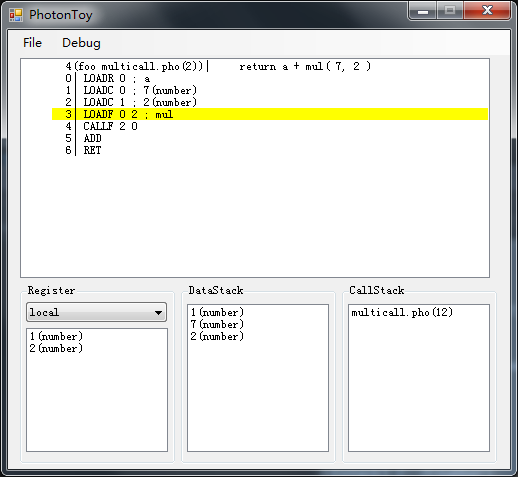

# PhotonSharp
一个结构易读的完整脚本系统

语言特性

* 无类型

* 多返回值

* 面向对象类支持, 无构造函数系统

* 包系统支持

* 静态类绑定

* 采用通用的词法分析器

语言一览

```golang
	// 函数调用
	func mul( a, b ){
	    return a * b
	}
	
	func foo( a, b ){
	    return a + mul( b, 2 )
	}
	
	var y = foo( 1, 2 )
	
	// 变量交换
	var x, y = 1, 2
	x, y = y, x
	
	// for数字循环
	var x = 10
	for i = 1;i < 3;i=i+1 {
	    x = x - 1
	}

	// 支持多层复杂闭包
	func foo( ){
		var a = 2

		return func( x ){
			var y = 1
			return x + y + a
		}
	}

	// 包支持	
	import "MyPackage"
	
	var c = MyPackage.AddValue( 1, 2 )
	

	// 面向对象支持
	class Animal {
		type
	}
	
	func Animal.foo( self ){
		self.type = "animal"
	}
	
	func Animal.out( self ){
		return self.type
	}
	
	
	class Cat : Animal{
	
	}
	
	func Cat.foo( self ){
		self.type = "cat"
	}
	
	
	var c = new(Cat)
	
	c.foo( )
	
	var k = c.out( )
```


# 调试器


## 特性

基本的StepIn, StepOut, StepOver 指令调试

数据栈, 调用栈和本地,包寄存器查看

	
# 备注

感觉不错请star, 谢谢!

博客: http://www.cppblog.com/sunicdavy

知乎: http://www.zhihu.com/people/xu-bo-62-87

邮箱: sunicdavy@qq.com
